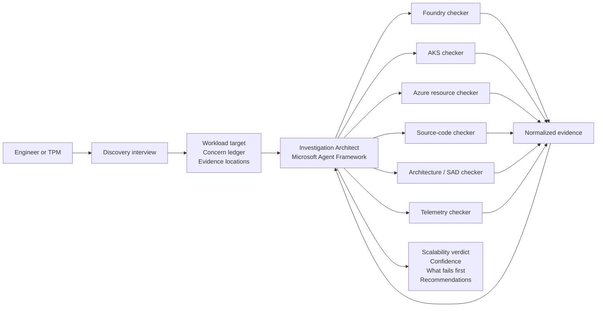
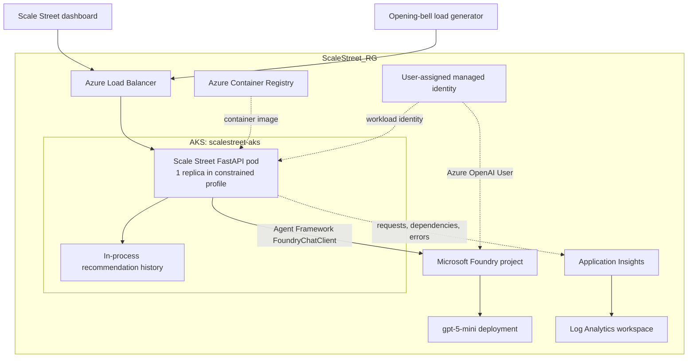
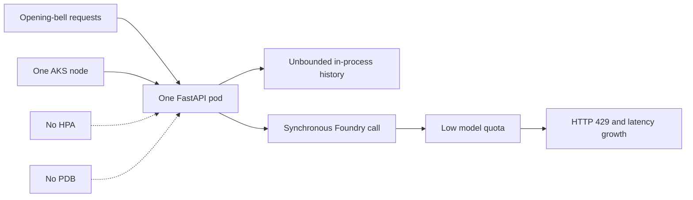

# Will It Scale?

An evidence-driven scalability investigation built with Microsoft Agent
Framework and Microsoft Foundry.

The project combines specialist checkers for application source, architecture,
Microsoft Foundry, AKS, Azure resources, and telemetry. An Investigation
Architect correlates their findings to answer:

> Given the expected workload and the available evidence, what is most likely
> to prevent this system from scaling?

## Scale Street demo

[`samples/scale_street`](samples/scale_street) contains **Scale Street**, a
financial-services themed FastAPI application designed to exercise the
investigation agents. It simulates paper-portfolio analysis during an
opening-bell traffic spike.

The demo deliberately includes explainable scalability constraints:

- Synchronous Microsoft Agent Framework calls to a Foundry model.
- No queue or back-pressure boundary.
- Runtime recommendation history held in pod memory.
- A single application replica and single-node AKS cluster.
- No HPA or Pod Disruption Budget in the constrained deployment.
- Drift between the target-state SAD and the deployed configuration.

The sample also includes an improved Kubernetes configuration, a synthetic
telemetry capture, and a load generator so the agents can compare intended
architecture, deployed state, source code, and runtime behavior.

## Will It Scale? architecture

The user begins with an interview that captures the target workload, current
scale, known concerns, critical journeys, and evidence locations. The
Investigation Architect then delegates read-only inspection to specialist
checkers and correlates their evidence into one assessment.



Each checker should return a common evidence shape containing the observation,
source reference, impact, recommendation, and confidence. This allows the
architect to identify agreement and contradictions across system layers rather
than producing independent summaries.

## Scale Street runtime architecture

Scale Street is deployed to AKS and uses Microsoft Agent Framework with a
Microsoft Foundry project. The default hackathon infrastructure is deliberately
constrained so the checkers have meaningful evidence to discover.



### Constrained deployment



The improved Kubernetes manifests demonstrate the intended remediation:
multiple replicas, resource requests and limits, topology spreading, a Pod
Disruption Budget, and Horizontal Pod Autoscaling. A production design would
also introduce a durable queue, external state, caching, and bounded Foundry
concurrency.

## Development

Install the project and its development dependencies:

```shell
uv sync
```

Run the CLI:

```shell
uv run will-it-scale
```

### Run Scale Street locally

```shell
cd samples/scale_street
uv sync
uv run uvicorn scale_street.main:app --reload
```

Open <http://127.0.0.1:8000> and select **Ring the Opening Bell**.

### Use Microsoft Agent Framework with Foundry

Scale Street uses `agent-framework-foundry`. The default local configuration
uses a deterministic simulation so development and tests do not consume model
quota. To use the Foundry-backed Hedgehog financial agent:

```shell
export SCALE_STREET_AGENT_MODE=foundry
export FOUNDRY_PROJECT_ENDPOINT=https://<resource>.services.ai.azure.com/api/projects/<project>
export FOUNDRY_MODEL=gpt-5-mini
az login
uv run uvicorn scale_street.main:app
```

### Azure deployment

The deployment targets:

- Subscription: `ef8ff4c4-777b-44e9-9491-e5e5e790f977`
- Resource group: `ScaleStreet_RG`
- Region: `eastus2`

It creates an Azure Container Registry, a deliberately single-node AKS
cluster, Log Analytics, Application Insights, a Microsoft Foundry account and
project, and a workload identity for the application. Model deployment is
disabled by default because available models and quota vary by subscription.

```shell
cd samples/scale_street
./scripts/deploy_azure.sh
```

The script builds the container in ACR, grants AKS pull access, applies the
constrained Kubernetes deployment, and prints the public URL when available.

After base provisioning, inspect the models available to the Foundry account
and deploy an eligible model. Then set `FOUNDRY_MODEL` to that deployment name.
The template retains an optional pinned model resource for environments where
that exact model version remains available.

### Hackathon fallback deployment

AKS provisioning in the FDPO subscription remained in `Creating` before node
infrastructure appeared. To keep the demo usable, the same ACR image is also
deployed to Azure Container Instances:

- Foundry-backed demo:
  `http://scalestreet-edhkf6pal5yca.eastus2.azurecontainer.io:8000`
- Deterministic backup:
  `http://scalestreet-live-edhkf6pal5yca.eastus2.azurecontainer.io:8000`

The Foundry-backed container uses the `scalestreet-workload` user-assigned
identity with the **Foundry User**, **Cognitive Services OpenAI User**, and
**AcrPull** roles. ACR Premium is required for the managed-identity image pull
used by Azure Container Instances.

The focused fallback templates are:

- `infra/container-instance.bicep`
- `infra/app-service.bicep`

App Service was not used in the FDPO subscription because its B1 worker quota
was zero. See `samples/scale_street/TODO.md` for the remaining AKS-only work.

## Repository structure

```text
src/will_it_scale/             Investigation CLI
samples/scale_street/          Financial-services demo application
  architecture/SAD.md          Target-state architecture
  infra/                       Azure Bicep deployment
  k8s/constrained/             Intentionally constrained deployment
  k8s/improved/                Recommended comparison deployment
  load_tests/                  Opening-bell load generator
  telemetry/                   Representative runtime evidence
  TODO.md                      Remaining AKS deployment work
```

## Demo investigation

The suggested intake concern is:

> We are worried the portfolio store will not handle 10,000 customers during
> the opening bell.

The expected investigation finds that storage is not the first constraint.
Source and telemetry evidence should instead identify synchronous Foundry
calls, model throttling, a single application replica, a single AKS node, and
in-process state. The SAD claims an asynchronous, horizontally scalable target
state, allowing the architecture checker to report release drift.

The final assessment should classify findings as:

- **Confirmed:** evidence supports a concern raised during intake.
- **Handled:** the concern is mitigated by the current implementation.
- **New:** the investigation discovered a different material risk.
- **Unknown:** available evidence is incomplete or contradictory.
