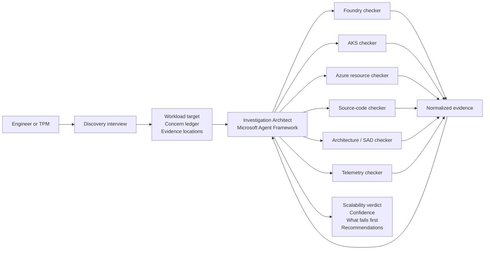
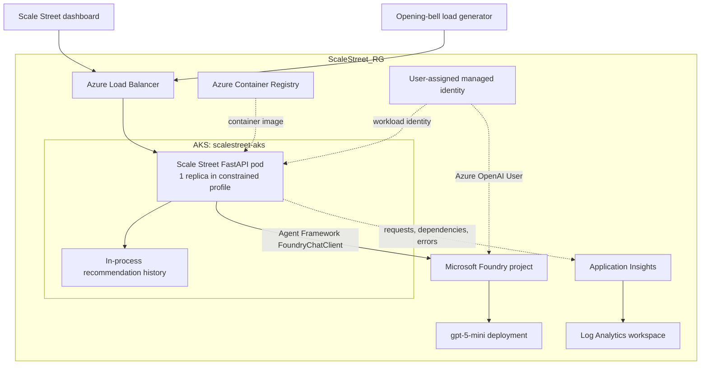
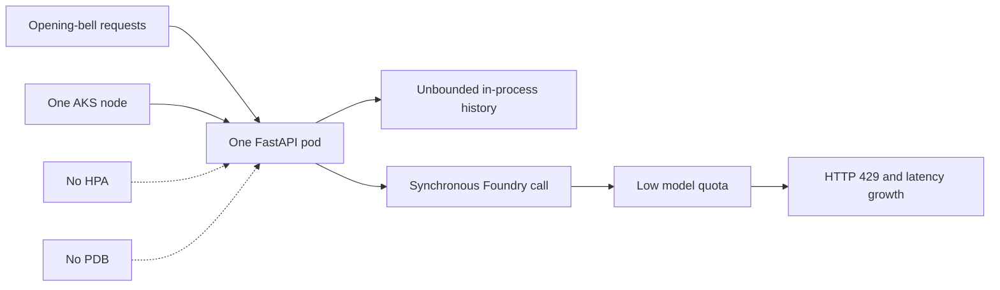

# Will It Scale?

An evidence-driven scalability investigation built with Microsoft Agent
Framework and Microsoft Foundry.

The project combines specialist checkers for application source, architecture,
Microsoft Foundry, AKS, Azure resources, and telemetry. An Investigation
Architect correlates their findings to answer:

> Given the expected workload and the available evidence, what is most likely
> to prevent this system from scaling?

## Scale Street demo

[`samples/scale_street`](samples/scale_street) contains **Scale Street**, a
financial-services themed FastAPI application designed to exercise the
investigation agents. It simulates paper-portfolio analysis during an
opening-bell traffic spike.

The demo deliberately includes explainable scalability constraints:

- Synchronous Microsoft Agent Framework calls to a Foundry model.
- No queue or back-pressure boundary.
- Runtime recommendation history held in pod memory.
- A single application replica and single-node AKS cluster.
- No HPA or Pod Disruption Budget in the constrained deployment.
- Drift between the target-state SAD and the deployed configuration.

The sample also includes an improved Kubernetes configuration, a synthetic
telemetry capture, and a load generator so the agents can compare intended
architecture, deployed state, source code, and runtime behavior.

## Will It Scale? architecture

The user begins with an interview that captures the target workload, current
scale, known concerns, critical journeys, and evidence locations. The
Investigation Architect then delegates read-only inspection to specialist
checkers and correlates their evidence into one assessment.



Each checker should return a common evidence shape containing the observation,
source reference, impact, recommendation, and confidence. This allows the
architect to identify agreement and contradictions across system layers rather
than producing independent summaries.

## Scale Street runtime architecture

Scale Street is deployed to AKS and uses Microsoft Agent Framework with a
Microsoft Foundry project. The default hackathon infrastructure is deliberately
constrained so the checkers have meaningful evidence to discover.



### Constrained deployment



The improved Kubernetes manifests demonstrate the intended remediation:
multiple replicas, resource requests and limits, topology spreading, a Pod
Disruption Budget, and Horizontal Pod Autoscaling. A production design would
also introduce a durable queue, external state, caching, and bounded Foundry
concurrency.

## Development

Install the project and its development dependencies:

```shell
uv sync
```

Run the CLI:

```shell
uv run will-it-scale
```

### Run Scale Street locally

```shell
cd samples/scale_street
uv sync
uv run uvicorn scale_street.main:app --reload
```

Open <http://127.0.0.1:8000> and select **Ring the Opening Bell**.

### Use Microsoft Agent Framework with Foundry

Scale Street uses `agent-framework-foundry`. The default local configuration
uses a deterministic simulation so development and tests do not consume model
quota. To use the Foundry-backed Hedgehog financial agent:

```shell
export SCALE_STREET_AGENT_MODE=foundry
export FOUNDRY_PROJECT_ENDPOINT=https://<resource>.services.ai.azure.com/api/projects/<project>
export FOUNDRY_MODEL=gpt-5-mini
az login
uv run uvicorn scale_street.main:app
```

### Azure deployment

The deployment targets:

- Subscription: supplied through `AZURE_SUBSCRIPTION_ID`
- Resource group: `ScaleStreet_RG`
- Region: `eastus2`

It creates an Azure Container Registry, a deliberately single-node AKS
cluster, Log Analytics, Application Insights, a Microsoft Foundry account and
project, and a workload identity for the application. Model deployment is
disabled by default because available models and quota vary by subscription.

```shell
cd samples/scale_street
./scripts/deploy_azure.sh
```

The script builds the container in ACR, grants AKS pull access, applies the
constrained Kubernetes deployment, and prints the public URL when available.

After base provisioning, inspect the models available to the Foundry account
and deploy an eligible model. Then set `FOUNDRY_MODEL` to that deployment name.
The template retains an optional pinned model resource for environments where
that exact model version remains available.

### Hackathon fallback deployment

Azure Container Instances temporarily hosted Foundry-backed and deterministic
fallbacks while AKS provisioning was blocked. Both fallback container groups
were removed on September 17, 2026 after the AKS deployment passed health,
readiness, and Foundry validation.

Retrieve an environment's endpoint instead of storing a live URL:

```shell
fqdn="$(az container show \
  --resource-group ScaleStreet_RG \
  --name <container-group> \
  --query ipAddress.fqdn \
  --output tsv)"
echo "http://${fqdn}:8000"
```

The fallback templates use the `scalestreet-workload` user-assigned identity
with the **Foundry User**, **Cognitive Services OpenAI User**, and **AcrPull**
roles. ACR Premium is required only while the Azure Container Instances
managed-identity image-pull fallback is deployed; the active AKS environment
uses ACR Basic.

The focused fallback templates are:

- `infra/container-instance.bicep`
- `infra/app-service.bicep`

App Service was not used in the FDPO subscription because its B1 worker quota
was zero. See `samples/scale_street/TODO.md` for the remaining AKS-only work.

## Deterministic assessment engine (`will_it_scale`)

Alongside the investigation agents, `src/will_it_scale` is a grounded, deterministic
assessment engine and CLI. It reads real Kubernetes state, applies coded checks
(replica floors, requests/limits, health probes, autoscaling, disruption budgets,
and pod rollout health), and can have Azure AI Foundry interpret the findings. The
model only ever consumes the grounded findings as evidence — it cannot reach the
cluster or invent facts. Read-only by design.

### Foundry configuration

Defaults point at a personal Azure AI Foundry project for now
(`deploy-assess-foundry` / `deploy-assess-project`, model `gpt-4.1`). This is
temporary — repoint with `FOUNDRY_PROJECT_ENDPOINT` and `FOUNDRY_MODEL` when access
to the target subscription is available (see `src/will_it_scale/config.py`).

### Provision infrastructure (Terraform)

```shell
cd infra/terraform
cp terraform.tfvars.example terraform.tfvars   # subscription IDs, target, model
terraform init && terraform apply
```

Creates the read-only collector managed identity and RBAC, an optional throwaway
AKS cluster (`create_test_aks = true`), and the Foundry account/model. Tear it all
down with `terraform destroy`.

### Run it

Everything runs through the single `will-it-scale` command; flags take precedence
over the `TARGET_*` / `ASSESS_SOURCE` environment variables:

```shell
uv run will-it-scale                                           # interactive TUI (agents)
uv run will-it-scale --checks                                  # deterministic findings only
uv run will-it-scale --checks --interpret                      # + Foundry interpretation
uv run will-it-scale --checks --source live --namespace demo   # assess a live namespace
```

The interactive TUI captures your workload requirements, runs the checks, then has
the agents reason over the grounded findings. Switch source mid-session with
`/live <namespace>` and `/manifest`; each run announces the source and the
deployments discovered there.

### Access for local runs

Running as your own identity needs **AKS RBAC Reader** on the cluster; `--interpret`
also needs **Cognitive Services OpenAI User** on the Foundry account. Azure RBAC for
Kubernetes caches decisions, so allow ~5 minutes after granting.

### Output and tests

Each run writes `findings/<label>/<timestamp>.json` (schema: `id`, `status`,
`evidence`, `confidence`, `severity`, `remediation`) and diffs against the previous
run for regressions. Run the deterministic suite with `uv run pytest`; it needs no
cluster or Azure access.

## Repository structure

```text
.github/agents/                   Azure Scale Investigator custom agent
agents/azure-scale-investigator/  Agent profile, checks, schemas, scripts, tests
src/will_it_scale/                Investigation CLI + deterministic assessment engine
infra/terraform/                  Read-only identity, RBAC, test AKS, Foundry (IaC)
tests/                            Deterministic checks, manifest, CLI, TUI suites
samples/scale_street/             Financial-services demo application
  architecture/SAD.md             Target-state architecture
  infra/                          Azure Bicep deployment
  k8s/constrained/                Intentionally constrained deployment
  k8s/improved/                   Recommended comparison deployment
  load_tests/                     Opening-bell load generator
  telemetry/                      Representative runtime evidence
  TODO.md                         Remaining AKS deployment work
```

## Demo investigation

The suggested intake concern is:

> We are worried the portfolio store will not handle 10,000 customers during
> the opening bell.

The expected investigation finds that storage is not the first constraint.
Source and telemetry evidence should instead identify synchronous Foundry
calls, model throttling, a single application replica, a single AKS node, and
in-process state. The SAD claims an asynchronous, horizontally scalable target
state, allowing the architecture checker to report release drift.

The final assessment should classify findings as:

- **Confirmed:** evidence supports a concern raised during intake.
- **Handled:** the concern is mitigated by the current implementation.
- **New:** the investigation discovered a different material risk.
- **Unknown:** available evidence is incomplete or contradictory.
The inline terminal UI first asks for the workload and reliability targets to assess,
then investigates the available configuration against those requirements. It streams a
short assessment and accepts follow-up questions in the same conversation.

Commands and controls:

- `/live <namespace>` switches to a live cluster namespace and re-investigates.
- `/manifest` switches back to the bundled manifest fixture.
- `/help` shows the available commands.
- `/clear` clears the visible transcript without resetting the conversation.
- `/retry` restarts a failed or cancelled initial investigation.
- `/exit` or `Ctrl+C` quits.
- `Esc` cancels the active investigation or response.

### Blender Easter Egg

Enter `/game` at the chat prompt to catch falling Kubernetes resources with the
startup animation's blender. Use the left and right arrow keys to move, `Space`
to pause, `R` to restart, and `Esc` to return to the conversation. Each catch earns
10 points; three misses end the round, and the pace increases with your score.
The game needs a playing area of at least 24 columns by 12 rows (a 24 by 14
terminal in inline mode) and pauses automatically below that size. Your
assessment and conversation are preserved.

With `--debug`, diagnostic logs are written to `will-it-scale.log` so they do not
interfere with the terminal UI.
