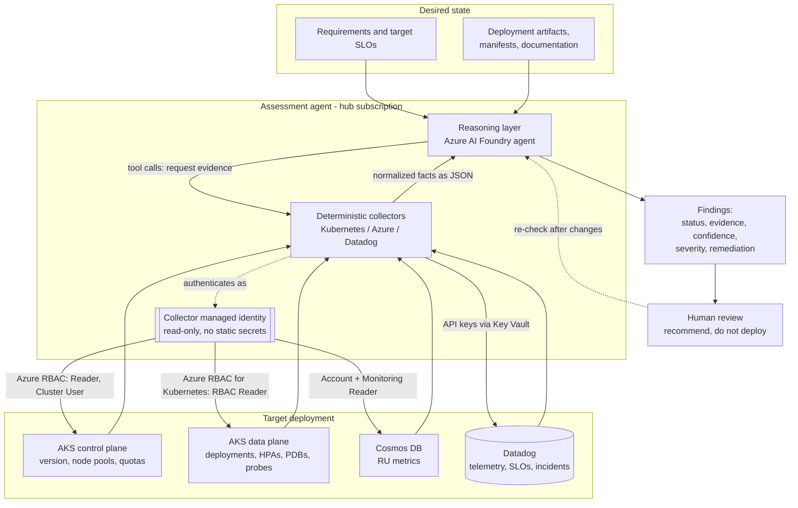

## Looping Deployment Assessment Agent

### Overview

A recurring, read-only agent that reconciles a deployment's **requirements** (desired state and target SLOs) against **what is actually running** (capacity, resources, permissions, documentation, and runtime health). It builds a desired-state model and an observed-state model, compares them, and produces findings with evidence, confidence, and severity for human review — then re-checks after changes. It recommends changes but does not deploy them.

Core signals and principles:

- Use **database Resource Units (RUs)** as a primary capacity and performance signal.
- Treat **permissions and access management** as a first-class concern; missing or inconsistent permissions are a recurring obstacle.
- Where documentation or required inputs are missing, identify the gap and provide a guided path to create the missing artifact rather than only reporting its absence.
- Infer architecture and operational context from existing artifacts: source repos (Kubernetes manifests, deployment config), Confluence, SADs, and architecture/release/change-management docs.

### Architecture

The agent separates reasoning from data collection so the model never fabricates facts. A managed identity provides read-only access to the target; deterministic collectors gather grounded evidence; the LLM layer interprets it and emits findings for human review.



### Open questions and decisions

- **RE team involvement**: clarify whether the Reliability Engineering team reviews findings and/or supplies operational context, and define that role.
- **Questionnaire fallback**: introduce a structured questionnaire/assessment to gather information that cannot be reliably inferred from artifacts.
- **Missing-artifact path**: when a required artifact (e.g. a SAD or runbook) is absent, provide a guided path to create it.
- **Cloud scope**: target platform is **Azure/AKS** for the experimental cluster (with Azure/Cosmos DB for RUs); confirm which telemetry source is authoritative (Datadog first).
- **Assessment areas to keep separated**: performance/runtime health, architecture/design, knowledge and documentation gaps, and how the system operates in production.

### The loop

Implement the agent as a recurring reconciliation loop rather than a one-time report:

```text
Requirements and target SLOs
      +
Deployment artifacts and documentation
      +
Runtime evidence and telemetry
      |
      v
    Normalize into a common model
      |
      v
  Compare desired state to observed state
      |
      v
  Findings with evidence, confidence, and severity
      |
      v
     Human review and recommended actions
      |
      +----> Re-check after changes
```

### Assessment model

Represent each requirement as a check with:

- `id`, category, and description
- desired value or rule, such as minimum replicas, CPU/memory capacity, RU budget, or required document
- observed value and source
- status: `pass`, `warning`, `fail`, or `unknown`
- confidence, timestamp, owner, and remediation guidance

### Initial checks

- **Capacity**: expected load versus provisioned capacity, autoscaling limits, database RU consumption, and headroom.
- **Resources**: CPU and memory requests/limits, replica counts, quotas, storage, and node capacity.
- **Reliability**: replicas, health probes, availability targets, backups, recovery objectives, and alert coverage.
- **Access**: required identities, roles, permissions, secrets, and missing access evidence.
- **Documentation**: required SADs, deployment/runbook material, ownership, release/change records, and operational gaps.
- **Runtime health**: latency, errors, saturation, alert history, and incident/support evidence.

### Kubernetes deployment checks

Concrete per-workload checks the Kubernetes collector should evaluate (declared state from manifests/live objects):

- **Autoscaling (HPA)**: is a Horizontal Pod Autoscaler defined? Are min/max replicas set and sensible for expected load?
- **Requests vs limits**: every container declares CPU/memory **requests** and **limits**; flag missing limits and large request-to-limit gaps (over/under-provisioning risk).
- **Minimum resource floor**: each container meets a minimum requests/limits baseline so pods are schedulable and not starved.
- **Node placement**: `nodeSelector`, affinity/anti-affinity, taints/tolerations, and topology spread constraints that determine which node a pod lands on.
- **Pod Disruption Budgets (PDB)**: a PDB exists with `minAvailable`/`maxUnavailable` set so voluntary disruptions can't take the workload down.
- **Eviction floor**: PDB `minAvailable` sets how many pods must stay running before Kubernetes will evict/kill more during voluntary disruptions (node drain, autoscaler scale-down, upgrades). Pair with anti-affinity/topology spread so replicas aren't all on one node.
- **Health probes**: readiness and liveness probes defined.

### Managed Kubernetes on Azure (AKS)

The experimental cluster runs on **AKS**, so the design targets that provider first. Keep the collector's provider detection so an EKS/GKE adapter can be added later, but the concrete checks below assume AKS.

- **Control plane is managed**: don't check control-plane components; check the AKS cluster's Kubernetes version, supported/EOL status against the [AKS version support policy](https://learn.microsoft.com/azure/aks/supported-kubernetes-versions), and the configured auto-upgrade channel.
- **Node pools + cluster autoscaler**: capacity checks must account for each node pool's min/max node count and the AKS cluster autoscaler, not just fixed nodes. Cross-check pod requests against the node pool's VM SKU (system vs user node pools).
- **Azure quotas**: regional vCPU/VM-family quotas and subnet IP space cap real scale headroom. For Azure CNI, subnet size and `maxPods` per node bound how many pods fit; kubenet has different limits. Pull via `az` CLI or Steampipe.
- **Workload Identity**: prefer AKS Workload Identity (federated to a Microsoft Entra managed identity) for the Access checks rather than static secrets. Store secrets in Azure Key Vault via the Secrets Store CSI driver.
- **Detection**: confirm the provider from node labels / `providerID` (`azure://...`) so the collector selects the AKS adapter and Azure quota source.

**Handy `az` commands for the collectors**

```bash
az aks show -g <rg> -n <cluster> -o json                 # version, network profile, identity
az aks nodepool list -g <rg> --cluster-name <cluster>    # node pool min/max, VM size, maxPods
az aks get-upgrades -g <rg> -n <cluster>                 # available/EOL versions
az vm list-usage -l <region> -o json                     # regional vCPU quota vs usage
```

### Cluster access & permissions

An in-cluster agent needs permissions at **two separate layers**, governed by different systems. Keep both strictly read-only.

**Identity**: run the agent under a **Microsoft Entra managed identity federated via AKS Workload Identity** (pod service account -> federated token -> Entra identity). No static secrets; the same identity carries both the Azure roles and the data-plane read access.

**1. Azure control plane (Azure RBAC / ARM)** — for the cluster object, node pools, autoscaler config, quotas, and Cosmos DB RU signals:

| Need | Least-privilege role | Scope |
|------|---------------------|-------|
| Read AKS config, node pools, upgrades | Azure Kubernetes Service Cluster Monitoring User, or Reader | the AKS resource |
| Get a kubeconfig for data-plane access | Azure Kubernetes Service Cluster User Role (`listClusterUserCredential`) | the AKS resource |
| Read vCPU/VM quotas | Reader | subscription or resource group |
| Read Cosmos DB RU metrics | Cosmos DB Account Reader Role + Monitoring Reader | the Cosmos account |

Avoid **Cluster Admin Role** — it pulls the admin credential and bypasses Kubernetes RBAC.

**2. Kubernetes data plane (Kubernetes RBAC)** — for per-workload checks (HPAs, requests/limits, PDBs, probes, events). The Kube API server authorizes every call even with a valid kubeconfig. Bind a read-only `ClusterRole` to the agent's identity:

```yaml
apiVersion: rbac.authorization.k8s.io/v1
kind: ClusterRole
metadata:
  name: assessment-agent-readonly
rules:
  - apiGroups: ["", "apps", "autoscaling", "policy", "networking.k8s.io"]
    resources: ["pods", "deployments", "replicasets", "statefulsets",
                "horizontalpodautoscalers", "poddisruptionbudgets",
                "services", "events", "nodes", "resourcequotas", "limitranges"]
    verbs: ["get", "list", "watch"]
```

The built-in `view` ClusterRole covers most of this but excludes `nodes` and some cluster-scoped objects needed for capacity/placement checks (it also excludes Secrets, which is desirable here) — hence the custom role.

If the cluster uses **Azure RBAC for Kubernetes authorization**, skip the ClusterRole/RoleBinding and instead assign **Azure Kubernetes Service RBAC Reader** to the agent's identity; Azure maps it to Kube read permissions.

### Collectors and tooling

Each collector follows the same pattern: **fetch -> normalize -> attach evidence**. Prefer tools that emit JSON so results are structured rather than scraped.

**Desired / declared state**

- Terraform / OpenTofu: `terraform show -json`, `terraform plan -json` for provisioned intent and quotas.
- Kubernetes manifests: parse YAML, validate with kubeconform/kubeval.
- Policy scans for declared gaps: Polaris, Kube-score, OPA Conftest (Rego), or Kyverno (JSON output). Catches missing limits, probes, and low replica counts.
- Steampipe: query cloud, Kubernetes, and IAM as SQL tables from one interface.

**Observed runtime state (Datadog as primary source)**

Datadog is the primary observability collector via its REST API (`datadog-api-client` for Python). Auth with `DD_API_KEY` + `DD_APP_KEY` and the correct DD site; cache per run to respect rate limits.

| Check | Datadog source | Endpoint |
|-------|----------------|----------|
| Capacity / saturation | Metrics (CPU, mem, RU, queue depth) | `POST /api/v1/query` |
| Resource usage vs limits | Cluster Agent `kubernetes.*` metrics | metrics query |
| Runtime health | APM traces, latency, error rate | `/api/v1/query`, APM API |
| Reliability targets | SLOs (native objects) | `GET /api/v1/slo`, `/slo/{id}/history` |
| Alert coverage & history | Monitors + events | `GET /api/v1/monitor`, `/api/v2/events` |
| Incident evidence | Incident Management | `GET /api/v2/incidents` |
| Infra inventory | Hosts / integrations | `GET /api/v1/hosts` |
| Error logs / gaps | Log Management | `POST /api/v2/logs/events/search` |

Datadog SLOs and Monitors are first-class objects, so read the team's existing SLO targets and compare attainment against them — that is the desired-vs-observed comparison without redefining "good".

**Not covered by Datadog**

- Declared infra/desired state: Terraform state + manifests.
- Documentation gaps: Confluence REST API + retrieval (RAG) to judge whether a doc actually covers a topic, not just whether it exists.
- Permissions/IAM: the `az` CLI (Azure RBAC role assignments, managed identities) or Steampipe's Azure plugin.

### Interfacing the AI model

Two layers so the model never fabricates facts:

- **Deterministic collectors** gather facts as JSON (the tools above).
- **LLM** only interprets: compares desired vs observed, explains gaps, prioritizes, and emits findings.

Expose collectors as callable tools (function calling or MCP) so the model requests grounded evidence instead of receiving raw dumps:

```text
LLM tools:
  dd_query_metric(query, window)   -> series JSON
  dd_get_slos(tags)                -> SLO targets + attainment
  dd_list_monitors(service)        -> monitors / coverage gaps
  dd_get_incidents(service)        -> incident history
  get_k8s_resources(namespace)     -> declared limits / replicas
  check_doc_exists(name)           -> documentation evidence
```

Force the model's output to match the check schema (`id`, `status`, `evidence`, `confidence`, `severity`, `remediation`) and validate that JSON before trusting it. Existing MCP servers for Datadog, Kubernetes, and GitHub, plus an agent framework (LangChain, Semantic Kernel, or Pydantic AI) with enforced JSON output, cover most of the glue.

### Guardrails

- Read-only by default; the first release recommends changes but does not deploy them.
- Every finding must include an evidence reference and distinguish `unknown` from `fail`.
- Use confidence scoring when evidence is incomplete or contradictory.
- Keep historical results so the agent can detect regressions and verify remediation.
- Require human approval before any future automated change.

### Suggested implementation stages

1. Define the requirement/check schema and result format.
2. Add collectors for Kubernetes manifests, deployment config, documentation, and telemetry (Datadog first).
3. Implement deterministic checks before adding an LLM-assisted gap analysis layer.
4. Add the questionnaire fallback for inputs that cannot be inferred, and the guided path for missing artifacts.
5. Persist findings and expose a report or API for review (involve the RE team if in scope).
6. Schedule the loop and compare each run with the previous baseline.
7. Add approved remediation workflows only after the read-only loop is trusted.